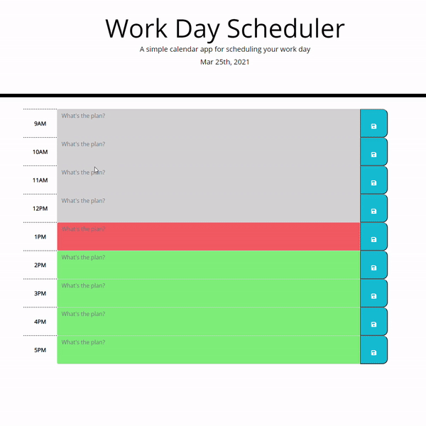

# Day-Planner
The purpose of this application is to allow users to schedule their work day schedule.
Users are allowed to create notes in each column by the hour, then save any changes.
Upon refreshing the page, the notes will still be there until removed and saved again.
Depending on the time, the column will change colors to represent past, present and future.
Color indicators are Grey (Past), Red (Present) and Green (Future).

# Website GIF

# Technologies Used
- BootStrap
- CSS
- FontAwesome
- Google Fonts
- HTML
- Javascript
- Jquery 
- Moment.js